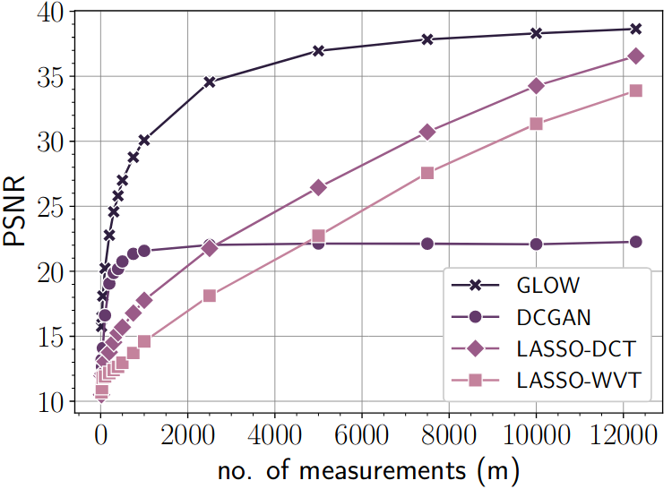
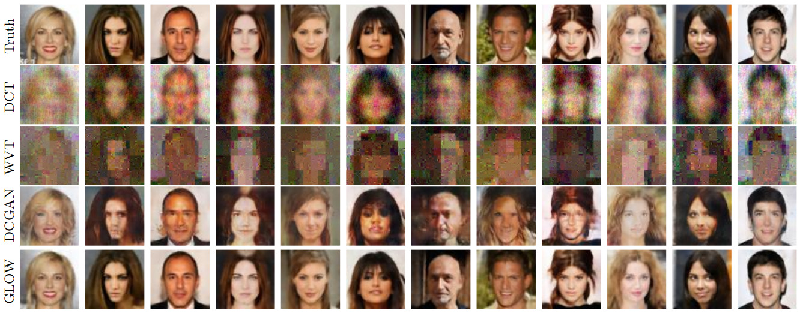
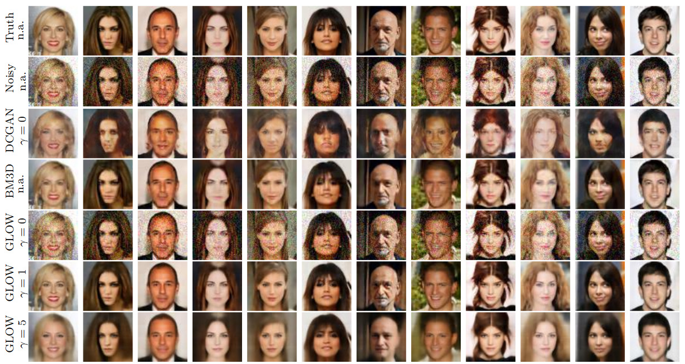

# GlowIP
Code to reproduce results from the [paper](https://arxiv.org/abs/1905.11672), **"Invertible generative models for inverse problems: mitigating representation error and dataset bias"** by M. Asim, Ali Ahmed and Paul Hand.


In this paper, we demonstrate that an invertible generative model, specifically GLOW, which have zero representation error by design, can be effective natural signal priors at inverse problems such as denoising, compressive sensing, and inpainting.


<table align="center">
  <tr>
     <td>
        
         <center/><b>Compressive Sensing</b>
     </td>
     <td>
        
         <center/><b>Denoising</b>
     </td>
  </tr>
</table>

<table align="center">
  <tr>
     <td>
        
         <center/><b>Compressive Sensing at m=750 (6%) measurements</b>
     </td>
  </tr>
</table> 

<table align="center">
  <tr>
     <td>
        
         <center/><b>Denoising</b>
     </td>
  </tr>
</table> 

<br/>
<br/>
<br/>

**Prepare Datasets**

To prepare training and validation dataset for celebA, birds and flowers, move into ```./data``` directory and run ```setup_{data}.sh``` followed by ```process_{data}.py``` as shown below. ```setup_{data}.sh``` will download and extract compressed files in the desired folders. The python script then ```proceess_{data}.py``` will then pre-process and split each data into training and validation sets used in the paper.  

```shell
cd data/
# prepare celeba
./setup_celeba.sh
python process_celeba.py
# prepare birds
./setup_birds.sh
python process_birds.py
# prepare flowers
./setup_flowers.sh
python process_flowers.py
```

The processed datasets will be placed in ```celeba_processed```, ```birds_processed``` and ```flowers_processed``` directories. Test Images, used in the paper, are placed in the directory ```test_images```. These were randomly extracted from the validation set of these processed datasets.

<br/>
<br/>
<br/>

**Training Generative Models**

To train generative models, simply run the ```train_{model}.py``` file from the root directory of the project.

```shell
# train glow on celeba
python train_glow.py -dataset celeba
# train dcgan on celeba
python train_dcgan.py -dataset celeba
# train glow on birds
python train_glow.py -dataset birds
# train dcgan on birds
python train_dcgan.py -dataset birds
# train glow on flowers
python train_glow.py -dataset flowers
# train dcgan on flowers
python train_dcgan.py -dataset flowers
```

The weights of Glow and DCGAN will be saved in ``` trained_models/{data}/glow/``` and  ```trained_models/{data}/dcgan/```. 

<br/>
<br/>
<br/>

>  Pre-trained models, used in the paper, can be downloaded from [add link here](). 


<br/>
<br/>
<br/>


**Solving Inverse Problems**

 For each inverse problem, there is an all purpose python script ```solve_{ip}.py``` that will be used.  See below code snippet for details.

```shell
# run denoising for celeba using dcgan as prior at noise level 0.1 and gamma 0 
python solve_denoising.py -experiment exp1 -dataset celeba -prior dcgan -model celeba \
-noise_std 0.1 -gamma 0 -init_std 0.1 -device cuda
# run cs for out-of-distribution (ood) images using glow as prior at m=5000 with gamma=0 
python solve_cs.py -experiment exp2 -dataset ood -prior glow -model celeba \
-m 5000 -gamma 0 -init_std 0 -device cuda
# run inpainting for celeba using glow as prior with gamma set to 0
python solve_inpainintg.py -experiment exp3 -dataset celeba -prior glow -model celeba \
-gamma 0 -init_std 0 -device cuda
```

The results of each experiment will be saved in the ```results``` directory. 

<br/>
<br/>
<br/>

> Pre-computed results can be downloaded from [add link here](). 

<br/>
<br/>
<br/>

**Run all experiments from paper**

To reproduce all experiments from paper, run all the shell scripts in the folder ```run/``` from the root directory of the project.

<br/>
<br/>
<br/>

**Generate Plots from paper**

All experiments from paper have been compiled as  ```*.csv``` files in ```plot/csvs/``` to reproduce plots from paper. Plots and their generating codes have been provided in ```plots.ipynb``` notebook.

<br/>
<br/>
<br/>


**Dependencies**

1. ubuntu==18.04
2. python==3.6
3. pytorch==1.0
4. torchvision==0.2.1
5. tensorflow==1.12
6. numpy
7. matplotlib
8. scikit-image
9. pillow
10. scikit-learn
11. easydict
12. scipy
13. glob
14. pandas
15. tqdm
