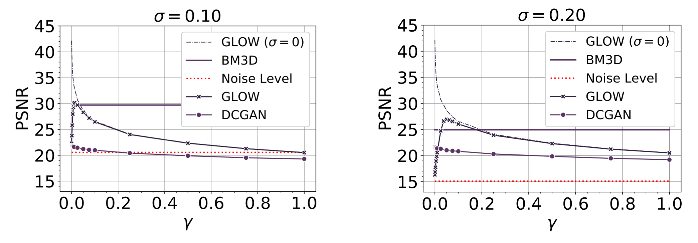
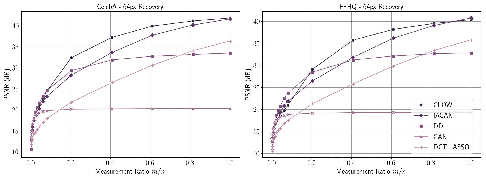
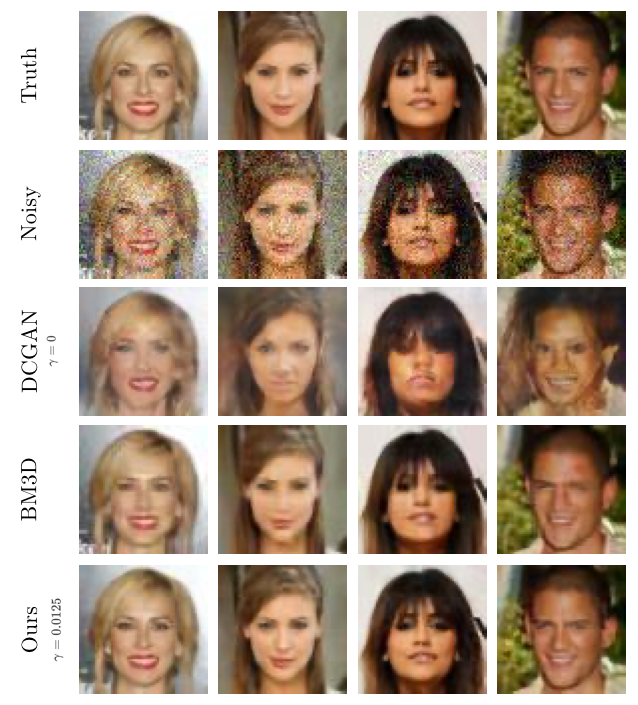
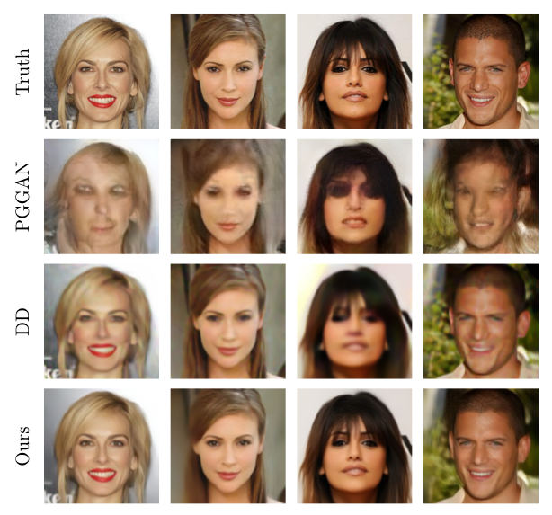

# GlowIP
Code to reproduce results from the [paper](https://arxiv.org/abs/1905.11672), **"Invertible generative models for inverse problems: mitigating representation error and dataset bias"** by M. Asim, Max Daniels, Ali Ahmed, Oscar Leong, and Paul Hand.


In this paper, we demonstrate that an invertible generative model, specifically GLOW, which have zero representation error by design, can be effective natural signal priors at inverse problems such as denoising, compressive sensing, and inpainting.


|  |
| :---: |
| <b> Denoising</b>: PSNR for 64px image denoising at the noise level . |
|  |
| <b> Compressive Sensing</b>: PSNR for 64px compressive sensing recoveries for in- and out-of-distribution images. |

|  |  |
| :---: | :---: |
| <b>Denoising</b>: qualitative results for 64px in-distribution denoising. | <b>Compressive Sensing</b>: qualitative results for 128px in-distribution compressive sensing, here with approximately 25% measurements.
<br/>
<br/>
<br/>

**Prepare Training Datasets**

To prepare training and validation datasets for [CelebA](http://mmlab.ie.cuhk.edu.hk/projects/CelebA.html), [Caltech-UCSD Birds 200](http://www.vision.caltech.edu/visipedia/CUB-200.html), and the [Oxford Flowers dataset](https://www.robots.ox.ac.uk/~vgg/data/flowers/), move into ```./data``` directory and run ```setup_{data}.sh``` followed by ```process_{data}.py``` as shown below. ```setup_{data}.sh``` will download and extract compressed files in the desired folders. The python script then ```process_{data}.py``` will then pre-process and split each data into training and validation sets.  

```shell
cd data/
# prepare celeba
./setup_celeba.sh
python process_celeba.py

# prepare birds
./setup_birds.sh
python process_birds.py

# prepare flowers
./setup_flowers.sh
python process_flowers.py
```

The processed datasets will be placed in ```celeba_processed```, ```birds_processed``` and ```flowers_processed``` directories.

We present results mainly for images from the CelebA validation set and from [Flickr-Faces-HQ](https://github.com/NVlabs/ffhq-dataset), along with additional results for a random selection of out-of-distribution qualitative images "in the wild." All test sets used in our experiments are available in the directory ```test_images```. 


<br/>
<br/>
<br/>

**Training Generative Models**

To train generative models, simply run the ```train_{model}.py``` file from the root directory of the project.

```shell
# train glow on celeba
python train_glow.py -dataset celeba

# train dcgan on celeba
python train_dcgan.py -dataset celeba

# train glow on birds
python train_glow.py -dataset birds

# train dcgan on birds
python train_dcgan.py -dataset birds

# train glow on flowers
python train_glow.py -dataset flowers

# train dcgan on flowers
python train_dcgan.py -dataset flowers
```

The weights of Glow and DCGAN will be saved in ``` trained_models/{data}/glow/``` and  ```trained_models/{data}/dcgan/```. 

<br/>
<br/>
<br/>

>  Pre-trained models, used in the paper, can be downloaded from [here](https://drive.google.com/file/d/12FZOOlcrcQ-8yHuZq21e1ESm5_Qis0Nh/view). Additionally, to run lasso-wavelet experiments for compressive sensing, generate the wavelet basis vectors by running `solvers/lasso_utils/wavelet_basis.py`.

<br/>
<br/>
<br/>


**Solving Inverse Problems**

 For each inverse problem, there is an all purpose python script ```solve_{ip}.py``` that will be used.  See below code snippet for details.

```shell
# run denoising for celeba using dcgan as prior at noise level 0.1 and gamma 0 
python solve_denoising.py -experiment exp1 -dataset celeba -prior dcgan -model celeba \
-noise_std 0.1 -gamma 0 -init_std 0.1 -device cuda

# run cs for out-of-distribution (ood) images using glow as prior at m=5000 with gamma=0 
python solve_cs.py -experiment exp2 -dataset ood -prior glow -model celeba \
-m 5000 -gamma 0 -init_std 0 -device cuda

# run inpainting for celeba using glow as prior with gamma set to 0
python solve_inpainintg.py -experiment exp3 -dataset celeba -prior glow -model celeba \
-gamma 0 -init_std 0 -device cuda
```

The results of each experiment will be saved in the ```results``` directory. 

**Please Note**: By default, inverse problems are solved in batches of 6 images. This may require more memory than available on certain hardware. With batch size set to 1, the model may crash early while solving the inverse problem, due to numerical instability. In this case, please try reducing the learning rate and increasing the number of training iterations, or try setting the batch size to 2-3 images. See the following examples:
```shell
# compressive sensing
python solve_cs.py -experiment exp1 -dataset celeba -prior glow -model celeba -m 12288 \
-lr 0.05 -gamma 0 -init_std 0 -batchsize 1 -steps 50

# denoising - with gamma > 0, the latent norm is encouraged not to blow up, and the default parameters are stable.
python solve_denoising.py -prior glow -experiment exp2 -dataset celeba -model celeba \
-gamma 0.75 -batchsize 1

# inpainting
python solve_inpainting.py -experiment exp3 -dataset celeba -prior glow -model celeba \
-lr 0.01 -gamma 0 -init_std 0 -batchsize 1 -steps 50
```


<br/>
<br/>
<br/>

**Run all experiments from paper**

To reproduce all experiments from paper, run all the shell scripts in the folder ```run/``` from the root directory of the project. For example,

```shell
# reproduce results of cs on out-of-distribution (ood) using glow prior
./run/run_ood_cs_glow_main.sh

# reproduce results of denoising on celeba using glow prior at noise level 0.1
./run/run_celeba_denoising_glow_noisestd_0.10.sh
```


<br/>
<br/>
<br/>

**Generate Plots from paper**

All experiments from paper have been compiled as  ```*.csv``` files in ```plot/csv/``` to reproduce plots from paper. Plots and their generating codes have been provided in ```plots.ipynb``` notebook.

<br/>
<br/>
<br/>

**Custom  Datasets**

To run experiments on any custom set of images, simply place the new set of images in the ```test_images``` folder with directory hierarchy matching the other image folders. The folder structure should be like  ```test_images/{custom}/imgs/```.  See example below.

```shell
# run cs on custom images using glow trained on celeba for m=5000 and gamma=0
python solve_cs.py -experiment exp4 -dataset {custom} -prior glow -model celeba \
-m 5000 -gamma 0 -init_std 0 -device cuda
```


<br/>
<br/>
<br/>

> It is preferred that you align face images for best results. 

<br/>
<br/>
<br/>

**Align Face Images**

First download this [file](https://drive.google.com/file/d/1mVsa7eImKyFOMtlDCbfV-rfPV_nxs9xr/view?usp=sharing) and place in ```align_faces/```  directory. To align face images, simply run ```align_faces/align_face.py``` as shown below.

```shell
python align_faces/align_faces.py -input {path_to_image} -output {path_to_output}
```

<br/>
<br/>
<br/>

**Dependencies**

1. ubuntu==18.04
2. python==3.6
3. pytorch==1.0
4. torchvision==0.2.1
5. tensorflow==1.12
6. numpy
7. matplotlib
8. scikit-image
9. pillow
10. scikit-learn
11. easydict
12. scipy
13. glob
14. pandas
15. tqdm

<br/>
<br/>
<br/>

**Citation**

If you find our work useful in your research or publication, please cite it:

```
@article{asim2019invertible,
  title={Invertible generative models for inverse problems: mitigating representation error and dataset bias},
  author={Asim, Muhammad and Ahmed, Ali and Hand, Paul},
  journal={arXiv preprint arXiv:1905.11672},
  year={2019}
}

```

